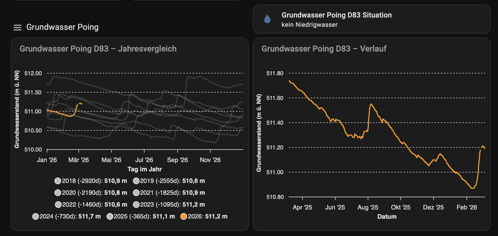

# Grundwasser Poing D83 – Home Assistant Bundle

**This code is generated by an AI.**

Data feed, historical CSV import, and dashboard cards for **Grundwasserstand Messstelle Poing D 83** (NID Bayern: [gkd.bayern.de](https://www.gkd.bayern.de)).

**Local setup for Poing.** This bundle is preconfigured for the measuring station **Poing D 83** in Bavaria. If you need data for another city or region, take this code and adapt it: change the NID resource URL in `integration/grundwasser.yaml` to your station’s table page, adjust `unique_id`/entity names, update the import script’s `ENTITY_ID` and CSV source/path if needed, and adapt the dashboard card entities. The NID HTML structure may differ per station—adjust the regex in the templates if your table layout is different.

## Canonical source

**This folder (`grundwasser-bundle/`) is the single source of truth** for the Grundwasser project. The sibling folder `HAss/grundwasser/` is deprecated (redirect only). Copies under `home-assistant-config/` are deployed snapshots — when in doubt, edit here and redeploy.

## Contents

| Path | Description |
|------|-------------|
| `integration/grundwasser.yaml` | REST sensors: level (m ü. NN), level (m u. Gelände), situation |
| `integration/grundwasser_helpers.yaml` | Template alias `…_situation_anzeige` for stable UI entity |
| `scripts/import-grundwasser-csv-to-recorder.py` | Import historical CSV into the recorder |
| `scripts/deploy-grundwasser.sh` | Deploy integration + helper files to Live-HA (dry-run default) |
| `ui/apex-grundwasser-card.yaml` | ApexCharts card: all years in one Jan–Dec comparison |
| `ui/apex-grundwasser-verlauf-card.yaml` | ApexCharts card: rolling 365-day history |
| `ui/tile-grundwasser-situation.yaml` | Tile card: situation with color (green/amber/red) |
| [doc/deploy.md](doc/deploy.md) | Deploy, verify, dashboard checklist |
| [doc/situation-alias.md](doc/situation-alias.md) | Stable UI alias `…_situation_anzeige` |
| [doc/csv-import.md](doc/csv-import.md) | Import instructions and troubleshooting |
| [doc/session-2026-05.md](doc/session-2026-05.md) | Session status (deployed, open items, SSH) |
| [doc/README.md](doc/README.md) | Doc index (`doc/` convention) |
| [ENTITY-IDS.md](ENTITY-IDS.md) | Live entity IDs (update from Developer Tools → States) |
| `ui/Home-Assistant-Grundwasser-Visual.png` | Screenshot of the dashboard (sample) |

## Visualization (sample)

The chart and situation tile together give a year-over-year view and current status:



## Requirements

- Home Assistant with **REST** and **Recorder** (SQLite)
- **Python 3.8+** for the import script (when running outside HA)

### HACS integrations (required for the dashboard cards)

Install these via [HACS](https://hacs.xyz/) (Home Assistant Community Store):

| Add-on | Purpose |
|--------|---------|
| **apexcharts-card** | Year comparison chart (ApexCharts) |
| **card-mod** | Situation tile with state-based colors |

After installing, add the frontend resources in **Settings → Dashboards → Resources** (or as prompted by HACS), then reload the dashboard.

## Quick setup

**Full deploy procedure:** [doc/deploy.md](doc/deploy.md)

### 1. Data feed (live sensors)

```bash
./scripts/deploy-grundwasser.sh          # dry-run
./scripts/deploy-grundwasser.sh --run    # copy to Live
```

Then in the **HA Web Terminal** (not `ssh ha "ha …"`): `ha core check` && `ha core restart`. Details: [doc/deploy.md](doc/deploy.md), SSH: [../home-assistant-config/doc/ssh-from-mac.md](../home-assistant-config/doc/ssh-from-mac.md).

Or copy `integration/grundwasser.yaml` and `integration/grundwasser_helpers.yaml` into HA `config/integrations/` manually. Entity IDs: **[ENTITY-IDS.md](ENTITY-IDS.md)**.

### 2. Historical data (optional)

- Get the CSV from [NID Bayern](https://www.nid.bayern.de/grundwasser/inn/poing-d-83-16268/tabelle) and save as `grundwasser_poing_historie.csv`.
- **Full import procedure** (stop HA, backup DB, dry-run, run import, start HA): [doc/csv-import.md](doc/csv-import.md).
- Set `recorder.purge_keep_days` to a large value (e.g. 13514) in Live `configuration.yaml` **before** importing.

### 3. Dashboard cards

Lovelace cards are **not** applied by the deploy script because the live dashboard uses
Home Assistant's **UI Storage mode**. Files under `ui/` are the version-controlled
source copies; changes made in the HA dashboard editor are not written back to this
repository automatically.

Paste the relevant files from `ui/*.yaml` into the **Umwelt & Region** view via
**Raw configuration**:

- `tile-grundwasser-situation.yaml` — current situation using the stable alias
- `apex-grundwasser-card.yaml` — all years in one comparison on every screen size
- `apex-grundwasser-verlauf-card.yaml` — rolling 365-day history

## Situation alias (UI vs REST)

| Entity | Role |
|--------|------|
| `sensor.grundwasser_poing_d83_situation` (or `_2`, `_3`, …) | REST source from NID — suffix depends on your HA instance |
| `sensor.grundwasser_poing_d83_situation_anzeige` | **Use in dashboard** — picks active REST source automatically |

Attribute `source_entity` on the alias shows which REST sensor is mirrored.

## CSV format (for import)

- Semicolon-separated; header/metadata in lines 1–8; data from line 9.
- Data rows: `YYYY-MM-DD;value;status` (value with comma as decimal, e.g. `511,22`).
- Rows with empty value are skipped (measurement gaps).

## License

MIT. Data source: Bayerisches Landesamt für Umwelt (LfU), [gkd.bayern.de](https://www.gkd.bayern.de).
